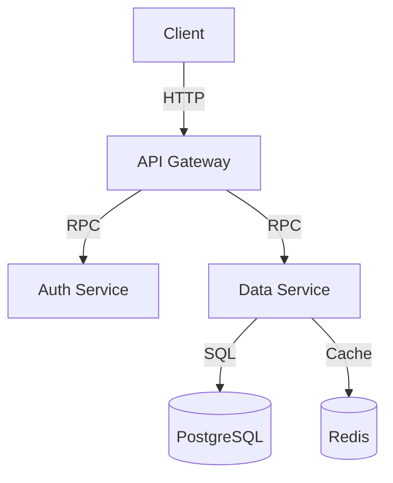
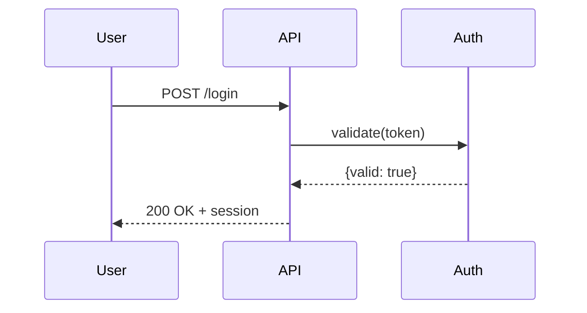

**Mermaid diagrams** (renders in GitHub, Notion, many markdown viewers):



**Diagram types:**
- `graph TD` — top-down flowchart
- `graph LR` — left-right flowchart
- `sequenceDiagram` — sequence/interaction diagram
- `classDiagram` — class relationships
- `erDiagram` — entity-relationship

**Sequence diagram example:**


**ASCII fallback** (for terminals and plain text):
```
[Client] → [Load Balancer] → [API Server] → [DB]
                                    ↓
                               [Cache]
```

**Workflow:**
1. Ask: what are the main components? what are the connections and data flows?
2. Choose diagram type based on what you want to show (flow, sequence, structure).
3. Write the Mermaid code in a fenced code block with ` ```mermaid `.
4. Validate syntax: check for unclosed brackets, mismatched arrows.
