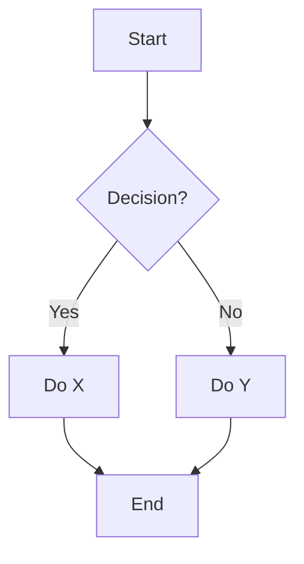
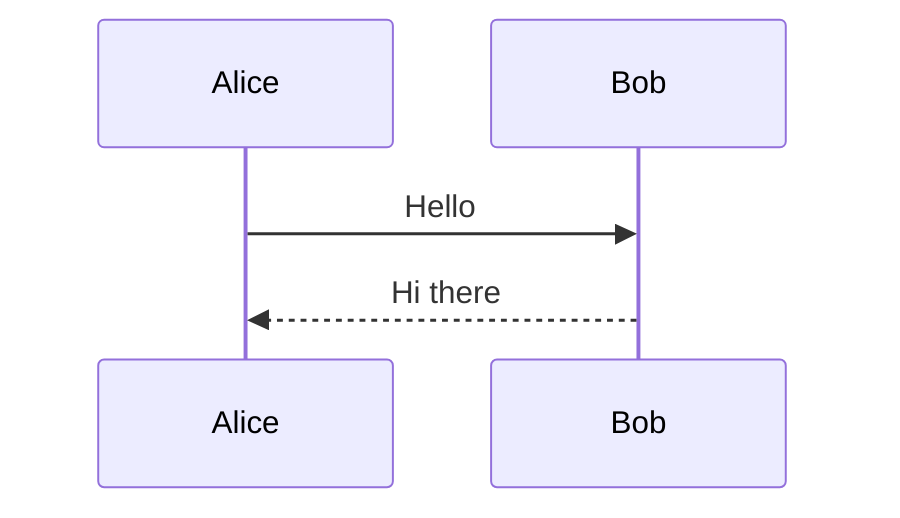

**Choose the right diagram type:**

| Goal | Type | Syntax |
|------|------|--------|
| Process / decision flow | Flowchart | Mermaid `graph TD` |
| API / service interactions | Sequence | Mermaid `sequenceDiagram` |
| Database schema | ER diagram | Mermaid `erDiagram` |
| Class structure | Class diagram | Mermaid `classDiagram` |
| State machine | State diagram | Mermaid `stateDiagram-v2` |
| Timeline | Gantt | Mermaid `gantt` |

**Flowchart:**


**Sequence:**


**ER Diagram:**
```mermaid
erDiagram
    USER ||--o{ ORDER : places
    ORDER ||--|{ LINE_ITEM : contains
    USER { string name, string email }
    ORDER { int id, date created }
```

**PlantUML alternative** (if Mermaid not available):
```bash
# Generate PNG from PlantUML text
cat diagram.puml | java -jar plantuml.jar -pipe > diagram.png
```

**Tips:**
- Mermaid renders natively in GitHub markdown, GitLab, and Notion.
- Keep diagrams focused — one concept per diagram.
- Use `note` in sequence diagrams to annotate complex steps.
